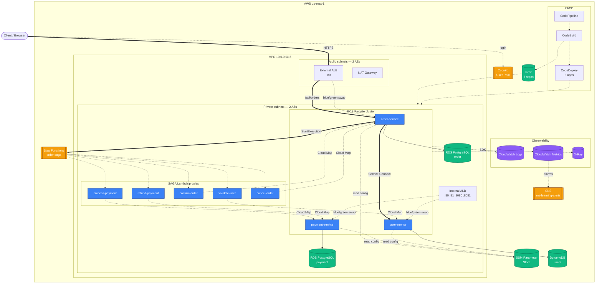
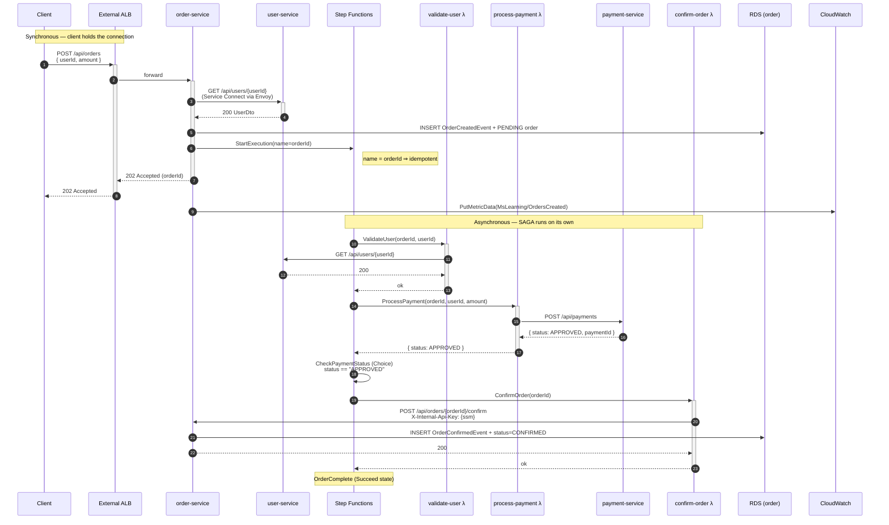
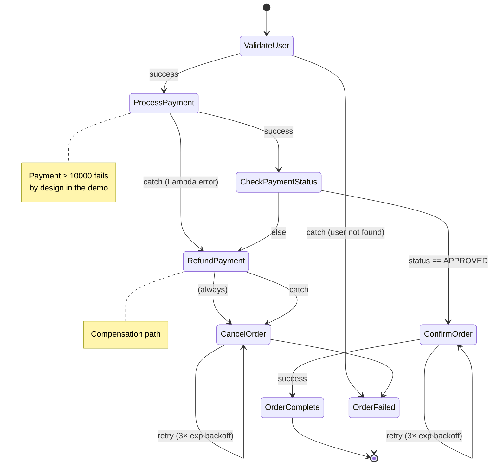
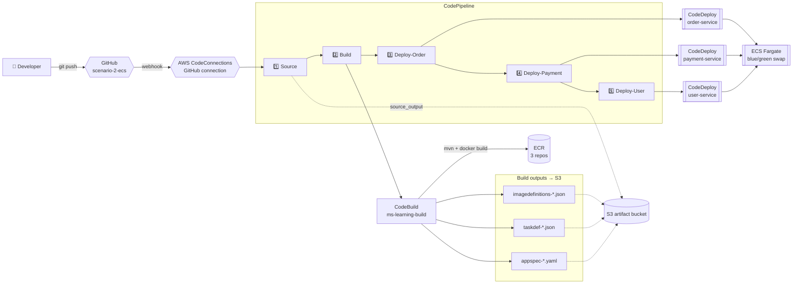
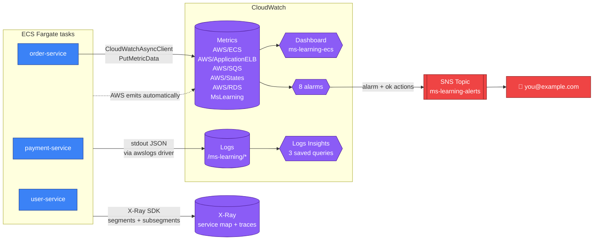
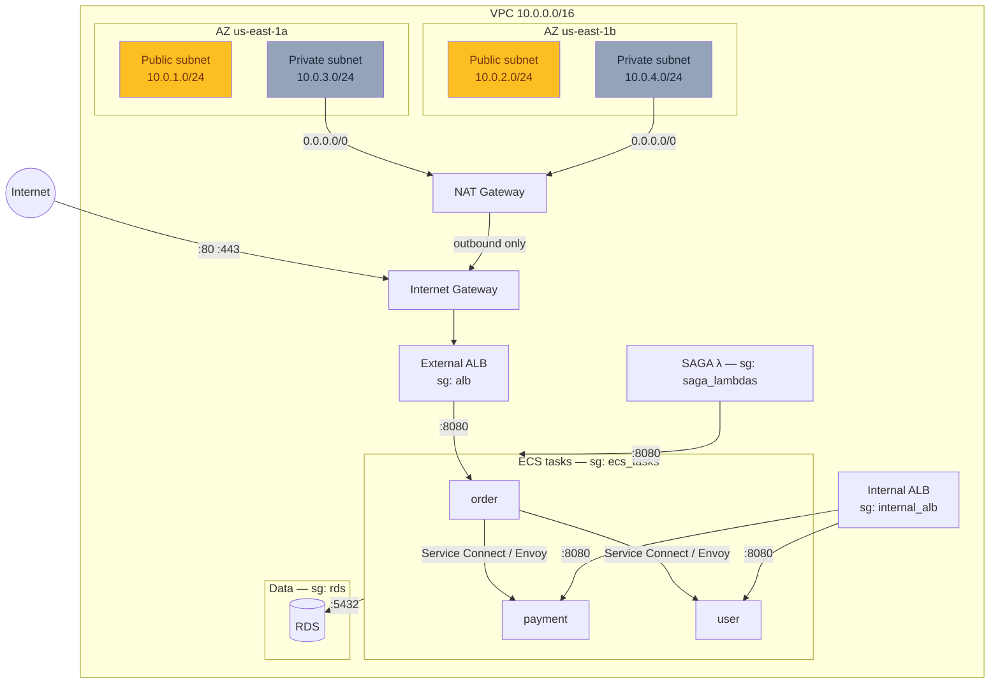

# Scenario 2 — Architecture Diagrams

Visual companion to [`scenario-2.md`](scenario-2.md) and [`scenario-2-setup.md`](scenario-2-setup.md). Every diagram below is authored in **Mermaid** so it lives with the source, versions in git, and renders inline on GitHub. If you want proper AWS-icon PNGs (for slides, presentations), see the [Python `diagrams` script](#appendix--generate-aws-icon-pngs) at the bottom.

**Diagram set:**

1. [System overview](#1-system-overview) — every component + how they connect
2. [Happy-path order creation](#2-happy-path-order-creation) — request sequence, service-by-service
3. [SAGA state machine](#3-saga-state-machine) — the Step Functions graph including compensations
4. [CI/CD pipeline](#4-cicd-pipeline) — GitHub push to blue/green deploy
5. [Observability data flow](#5-observability-data-flow) — where logs, metrics, and traces land
6. [Networking layer (VPC)](#6-networking-layer-vpc) — subnets, security groups, traffic paths

---

## 1. System overview

The full runtime picture. Solid arrows are hot-path request traffic; dashed arrows are control-plane / async.



**What the shapes mean:**
- Rectangles → compute or app services
- Cylinders → data stores or state
- Double-bordered rectangles → AWS-managed services

**Trust boundaries visible here:**
- Internet → ALB (public subnet) → private subnets. Nothing else crosses that edge.
- Managed services (Cognito, Step Functions, SSM, DynamoDB, CloudWatch, X-Ray) live outside your VPC but are reached via HTTPS AWS endpoints. Their identity is IAM, not network — that's why the IAM roles in `iam.tf` matter.

---

## 2. Happy-path order creation

A `POST /api/orders` from the client all the way through to `CONFIRMED` state. Note the boundary between synchronous (client waits) and asynchronous (SAGA drives it):



**Two things worth internalising from this diagram:**

1. **The client gets a 202 before the SAGA even starts.** The order is in `PENDING`, not `CONFIRMED`. If the client polls `GET /api/orders/{id}` immediately, it sees `PENDING`. The status flips to `CONFIRMED` seconds later when the SAGA finishes. That's the trade-off of async orchestration: faster response, eventual consistency.

2. **Two separate calls to user-service.** The first (step 3) is a synchronous fast-fail — if the user doesn't exist, we don't even bother starting the SAGA. The second (inside `ValidateUser` Lambda) re-validates because the SAGA state machine is designed to be independently testable and might be invoked from other triggers in the future.

---

## 3. SAGA state machine

The full Step Functions graph — including the compensation branch (RefundPayment → CancelOrder) that runs when payment fails or errors.



**Design principles baked into this graph:**

- **Compensations only for actions that leave persistent side effects.** `ValidateUser` doesn't write anything, so its failure just aborts (→ `OrderFailed`). `ProcessPayment` may have charged the customer, so its failure triggers `RefundPayment` → `CancelOrder` (both write compensating rows).
- **Retries on the terminal write operations (`ConfirmOrder`, `CancelOrder`).** These call our own services and are idempotent — safe to retry. Retrying `ProcessPayment` is not safe (would double-charge), so it has no `Retry` block, only a `Catch`.
- **`OrderFailed` is a `Fail` state, not a status.** It stops the execution with an error, which surfaces in the Step Functions console. The read-model status ends up `CANCELLED` (written by `CancelOrder`), not "OrderFailed."

---

## 4. CI/CD pipeline

The dataflow through CodePipeline when a developer pushes to `scenario-2-ecs`.



**What each stage produces:**

| Stage | Input | Output | Duration |
|---|---|---|---|
| Source | GitHub commit | `source_output.zip` in S3 | ~5s |
| Build | `source_output` | 3× docker images in ECR + `taskdef-*.json` + `appspec-*.yaml` + `imagedefinitions-*.json` in `build_output.zip` | ~4–6 min |
| Deploy-Order | `build_output` | new task-def revision, blue/green swap on external ALB | ~5–8 min |
| Deploy-Payment | `build_output` | new task-def revision, blue/green swap on internal ALB :80 | ~5–8 min |
| Deploy-User | `build_output` | new task-def revision, blue/green swap on internal ALB :81 | ~5–8 min |

**Why the deploys are sequential** — a failure in one stage stops the pipeline before touching the next service. Turn them into parallel actions inside a single stage if you want faster deploys and accept broader blast radius on failure.

---

## 5. Observability data flow

Every place a piece of telemetry lands and how alerts propagate.



**The three data flows to notice:**

1. **Logs** — every stdout line goes through the `awslogs` Docker driver into CloudWatch Logs, one log group per service, 7-day retention. Structured as JSON via Logstash encoder (see `logback-spring.xml`). Correlatable across services via the `traceId` MDC field.
2. **Metrics** — three sources: (a) AWS namespaces (`AWS/ECS`, `AWS/RDS`, ...) populated automatically; (b) custom `MsLearning/OrdersCreated` pushed from `OrderCommandHandler`; (c) the dashboard reads all of them and the alarms watch specific ones.
3. **Traces** — the X-Ray SDK (`AWSXRayServletFilter`) creates a segment per HTTP request, adds subsegments for the inter-service calls (`user-service-call`, `saga-start`) and payment processing. Traces are stitched by trace ID across services.

---

## 6. Networking layer (VPC)

A closer look at the VPC — subnets, routing, and security-group ingress.



**Security-group ingress rules (who can send to whom):**

| Security group | Allows ingress from | On port | Why |
|---|---|---|---|
| `alb` | `0.0.0.0/0` | 80, 443 | Public HTTP/S from anywhere |
| `internal_alb` | VPC CIDR | 80, 81, 8080, 8081 | Reachable only from inside the VPC |
| `ecs_tasks` | `alb` SG | 8080 | External ALB → order-service |
| `ecs_tasks` | `internal_alb` SG | 8080 | Internal ALB → payment/user |
| `ecs_tasks` | `ecs_tasks` (self) | all | Envoy sidecar service-to-service |
| `ecs_tasks` | `saga_lambdas` SG | 8080 | SAGA Lambdas → services |
| `rds` | `ecs_tasks` SG | 5432 | Only ECS tasks can talk to PostgreSQL |

**Routing summary:**
- Public subnets → route `0.0.0.0/0` to the Internet Gateway. That's what makes them "public."
- Private subnets → route `0.0.0.0/0` to the NAT Gateway (which is in a public subnet). Outbound-only reachability.
- Every subnet has an implicit route to `10.0.0.0/16 → local` so anything in the VPC can reach anything else at the network layer (SGs then decide who's actually allowed).

---

## Appendix — Generate AWS-icon PNGs

If you want proper AWS-service-icon PNGs (for slide decks, whitepapers, wall posters), use the [`diagrams`](https://diagrams.mingrammer.com/) Python library. Install and run:

```bash
pip install diagrams
brew install graphviz    # or apt-get install graphviz on Linux
```

Save this as `diagrams-scenario-2.py` and run `python3 diagrams-scenario-2.py`:

```python
from diagrams import Diagram, Cluster, Edge
from diagrams.aws.compute import ECS, Fargate, Lambda
from diagrams.aws.database import RDS, Dynamodb
from diagrams.aws.integration import SQS, StepFunctions, SNS
from diagrams.aws.management import Cloudwatch, SystemsManagerParameterStore
from diagrams.aws.network import ALB, InternetGateway, NATGateway, VPC, PrivateSubnet, PublicSubnet
from diagrams.aws.security import Cognito, IAMRole
from diagrams.aws.storage import S3
from diagrams.aws.devtools import Codepipeline, Codebuild, Codedeploy
from diagrams.aws.general import User

with Diagram("Scenario 2 — Overall Architecture", show=False, direction="TB", filename="scenario-2-overall"):
    client = User("Client")

    with Cluster("AWS us-east-1"):
        cognito = Cognito("User Pool")
        ssm = SystemsManagerParameterStore("Parameter Store")

        with Cluster("VPC 10.0.0.0/16"):
            with Cluster("Public subnets"):
                alb = ALB("External ALB")
                nat = NATGateway("NAT")

            with Cluster("Private subnets"):
                with Cluster("ECS Fargate"):
                    order = Fargate("order-service")
                    payment = Fargate("payment-service")
                    user_svc = Fargate("user-service")

                internal_alb = ALB("Internal ALB")

                with Cluster("SAGA λ proxies"):
                    lambdas = [
                        Lambda("validate-user"),
                        Lambda("process-payment"),
                        Lambda("confirm-order"),
                        Lambda("refund-payment"),
                        Lambda("cancel-order"),
                    ]

                rds_order = RDS("RDS order")
                rds_payment = RDS("RDS payment")

        dynamo = Dynamodb("users")
        sfn = StepFunctions("order-saga")

        with Cluster("Observability"):
            cw = Cloudwatch("Logs + Metrics")

        sns = SNS("alerts")

    client >> alb >> order
    order >> Edge(label="Service Connect") >> user_svc
    order >> Edge(label="StartExecution") >> sfn
    order >> rds_order
    user_svc >> dynamo
    payment >> rds_payment
    sfn >> Edge(style="dashed") >> lambdas
    for lam in lambdas:
        lam >> Edge(style="dashed") >> [order, payment, user_svc][0]
    order >> Edge(style="dashed") >> cw
    cw >> Edge(color="red") >> sns


with Diagram("Scenario 2 — CI/CD Pipeline", show=False, direction="LR", filename="scenario-2-cicd"):
    dev = User("Developer")

    with Cluster("CodePipeline"):
        source = Codepipeline("Source")
        build = Codebuild("Build")
        deploy_o = Codedeploy("Deploy-Order")
        deploy_p = Codedeploy("Deploy-Payment")
        deploy_u = Codedeploy("Deploy-User")
        source >> build >> deploy_o >> deploy_p >> deploy_u

    with Cluster("ECS Fargate"):
        order = Fargate("order-service")
        payment = Fargate("payment-service")
        user_svc = Fargate("user-service")

    artifacts = S3("Artifacts")

    dev >> Edge(label="git push") >> source
    build >> artifacts
    deploy_o >> order
    deploy_p >> payment
    deploy_u >> user_svc
```

**Output:** `scenario-2-overall.png` and `scenario-2-cicd.png` in your working directory. Embed them in slides, or check them into `docs/` alongside these Mermaid ones.

**Why keep both formats:** Mermaid diagrams live with the source, render on GitHub, are easy to edit; icon-based PNGs look prettier in slides but need a build step to regenerate.

---

## Where to reference these

- **Onboarding new engineer** → start with [System overview](#1-system-overview), then read [`scenario-2.md`](scenario-2.md) top-to-bottom.
- **Debugging a specific request** → [Happy-path order creation](#2-happy-path-order-creation) shows what should happen; then jump to X-Ray or Logs Insights to compare.
- **Explaining "why is this so complex?"** → the [SAGA state machine](#3-saga-state-machine) makes the compensation reasoning visible.
- **Planning a change to deploys** → [CI/CD pipeline](#4-cicd-pipeline).
- **Adding a new alarm or metric** → [Observability data flow](#5-observability-data-flow).
- **Firewall / network audit** → [Networking layer](#6-networking-layer-vpc).
